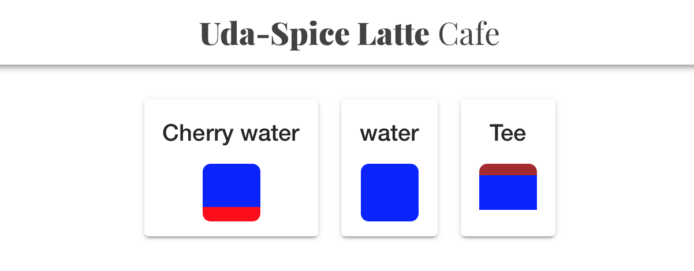
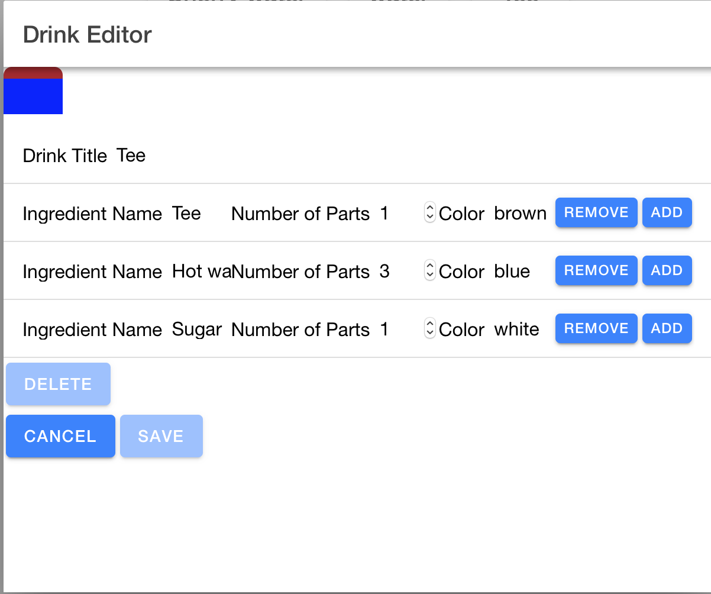
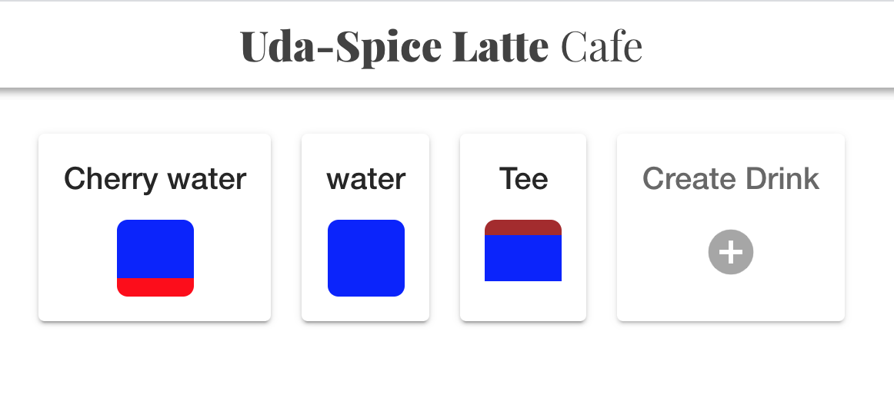
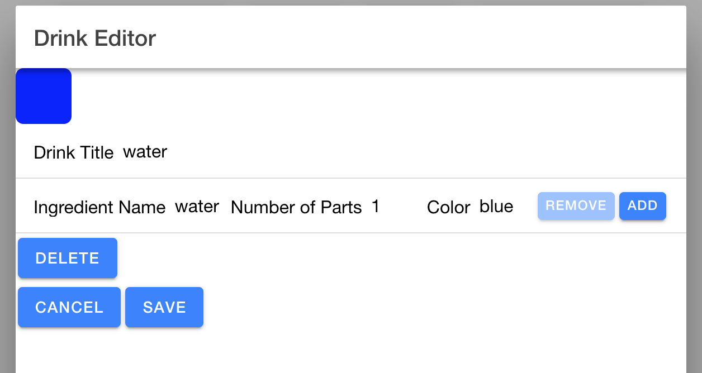

# Coffee Shop Full Stack

## Full Stack Nano - IAM Final Project

## **Introduction**
Udacity has decided to open a new digitally enabled cafe for students to order drinks, socialize, and study hard. But they need help setting up their menu experience.
The goal of this project is:

The application:

1) Displays graphics representing the ratios of ingredients in each drink.

2) Allows public users to view drink names and graphics.

3) Allows the shop baristas to see the recipe information.

4) Allows the shop managers to create new drinks and edit existing drinks.

## **Getting Started**

**Pre-requisites and Local Development**
Developers using this project should already have Python3, pip, and node installed on their local machines.

For detail setup directions read the READMEs in:

1. [`./backend/`](./backend/README.md)
2. [`./frontend/`](./frontend/README.md)

## About the Stack

### Backend

The `./backend` directory contains a completed Flask server.
[View the README.md within ./backend for more details.](./backend/README.md)

### Frontend

The `./frontend` directory contains a complete Ionic frontend to consume the data from the Flask server. You will only need to update the environment variables found within (./frontend/src/environment/environment.ts) to reflect the Auth0 configuration details set up for the backend app. 

[View the README.md within ./frontend for more details.](./frontend/README.md)
